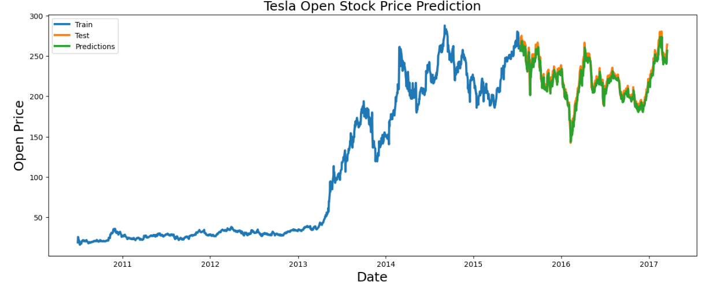
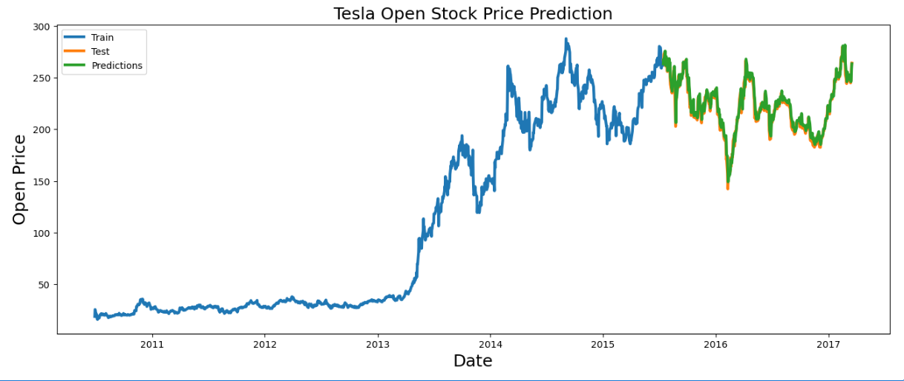

# Tesla Stock Forecasting using Deep Learning

An end-to-end deep learning time series forecasting system that predicts Tesla stock prices by modeling historical market behavior. This project compares **Long Short-Term Memory (LSTM)** and **Gated Recurrent Unit (GRU)** architectures under identical experimental conditions to determine which recurrent neural network better captures temporal dependencies in financial time series.

---

# Why I Built This

Financial markets are highly dynamic, making stock price forecasting one of the most challenging time-series prediction problems.

Rather than building a single forecasting model, I wanted to investigate how different recurrent neural network architectures perform when every aspect of the experiment remains constant except the recurrent layer itself.

The objective was to make model selection based on experimental evidence instead of assumptions.

---

# Engineering Problem

Traditional machine learning algorithms struggle to capture long-term temporal relationships present in sequential financial data.

Recurrent Neural Networks address this limitation by learning from previous observations, but different recurrent architectures behave differently when modeling long-term dependencies.

This project investigates the following engineering question:

> **Under identical training conditions, does an LSTM or a GRU provide better forecasting performance for Tesla stock prices?**

---

# System Workflow

```text
Historical Stock Prices
          │
          ▼
Data Cleaning
          │
          ▼
Feature Scaling
(MinMaxScaler)
          │
          ▼
Sequence Generation
          │
          ▼
Deep Learning Model
      ┌───────────────┐
      │               │
      ▼               ▼
    LSTM             GRU
      │               │
      └──────┬────────┘
             ▼
Performance Evaluation
(RMSE Comparison)
             │
             ▼
Best Model Selection
             │
             ▼
Future Stock Price Prediction
```
---

# Model Architecture

Both forecasting models share the same architecture except for the recurrent layer.

Architecture:

- Sequential Model
- Recurrent Layer (GRU / LSTM)
- Dense Output Layer

The trained models were saved in `.keras` format for future inference.

---

# Dataset

The project uses historical Tesla stock market data.

Features include:

- Open Price
- High Price
- Low Price
- Close Price
-  Volume
-  Adj Close

The data was transformed into sequential windows suitable for recurrent neural network training.

---

# Model Comparison

Both models were evaluated using **Root Mean Squared Error (RMSE)**.

| Model | RMSE | Status |
|---------|------:|----------------------|
| GRU | **3.84** | Comparative Benchmark |
| LSTM | **1.86** | Final Selected Model |

The LSTM model achieved a significantly lower RMSE, demonstrating a stronger ability to capture long-term temporal dependencies within the Tesla stock price series.

---

# Results
### Actual vs Predicted Prices - GRU Model



### Actual vs Predicted Prices - LSTM Model



---

# Key Engineering Decisions

## Why compare LSTM and GRU?

Both architectures are widely used for sequence modeling.

Instead of assuming one performs better, this project evaluates both using identical experimental conditions to make an evidence-based model selection.

---

## Why RMSE?

RMSE penalizes larger prediction errors more heavily than smaller ones, making it an effective metric for evaluating regression performance in stock forecasting.

---

## Why maintain identical training conditions?

Changing multiple variables simultaneously makes it difficult to determine the true cause of performance differences.

By modifying only the recurrent layer, the experiment isolates the impact of architectural choice on forecasting accuracy.

---

# Challenges Faced

During development, several practical challenges were encountered:

- Preparing sequential time-series data.
- Selecting an appropriate sequence length.
- Preventing overfitting.
- Comparing architectures fairly.
- Evaluating forecasting accuracy using regression metrics.

---

# Key Learnings

This project strengthened my understanding of deep learning for sequential data.

Key takeaways include:

- Preparing time-series datasets for recurrent neural networks.
- Understanding temporal dependencies.
- Comparing deep learning architectures through controlled experimentation.
- Evaluating regression models using RMSE.
- Making model selection based on empirical evidence rather than assumptions.

---

# Tech Stack

### Programming

- Python

### Deep Learning

- TensorFlow
- Keras

### Machine Learning

- Scikit-learn

### Data Processing

- Pandas
- NumPy

### Visualization

- Matplotlib

### Development Environment

- Jupyter Notebook

---

# Project Structure

```text
Tesla_Stock_Forecasting/
│
├── notebooks/
│   ├── LSTM_Model.ipynb
│   └── GRU_Model.ipynb
│
├── models/
│   ├── lstm_model.keras
│   └── gru_model.keras
│
├── images/
│   ├── lstm_prediction.png
│   ├── gru_prediction.png
│   ├── lstm_training_curve.png
│   ├── gru_training_curve.png
│   └── model_comparison.png
│
├── requirements.txt
├── README.md
└── LICENSE
```

---

# Installation

## Clone Repository

```bash
git clone <repository-url>
```

## Install Dependencies

```bash
pip install -r requirements.txt
```

---

# Running the Project

Run either notebook:

- `LSTM_Model.ipynb`
- `GRU_Model.ipynb`

to reproduce the experimental results.

---

# Future Improvements

- Evaluate Transformer-based time-series models.
- Forecast multiple stocks simultaneously.
- Incorporate market sentiment analysis.
- Integrate economic indicators and macroeconomic variables.
- Deploy the forecasting system as an interactive web application.
- Compare against statistical forecasting methods such as ARIMA and Prophet.

---

